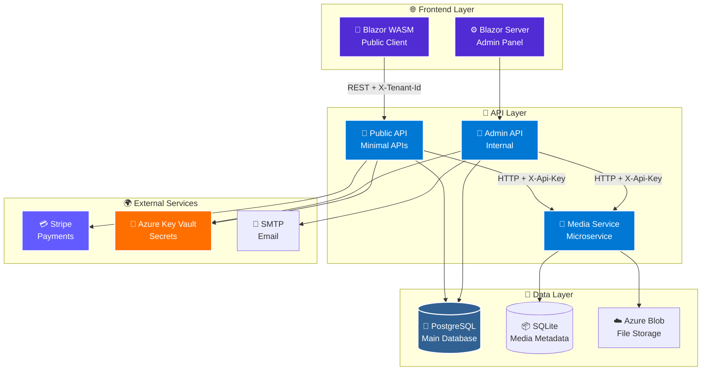

<div align="center">

# 🏂 SportRental

### *Enterprise-Grade Multi-Tenant Sport Equipment Rental Platform*

**Engineered with .NET 9 • Blazor • Azure • Stripe**

---

[](https://dotnet.microsoft.com/)
[](https://learn.microsoft.com/aspnet/core/blazor/)
[](https://azure.microsoft.com/)
[](https://www.postgresql.org/)

[](#-testing--quality)
[](#-license)
[](#-project-status)

</div>

---

## 🚀 **Quick Overview**

> **SportRental** is a **production-ready, enterprise-grade** multi-tenant platform for sport equipment rental businesses. Built with cutting-edge .NET 9 technologies, it features complete **Stripe payment integration**, **Azure cloud services**, **automated PDF contracts**, and a stunning **Blazor UI**.

### **🎯 Perfect For:**
- 🏂 Ski & Snowboard Rental Shops
- 🚴 Bike Rental Companies
- 🏄 Water Sports Equipment Rentals
- ⛷️ Multi-Location Rental Chains
- 🏢 SaaS Rental Platforms

---

## ✨ **Key Features**

<table>
<tr>
<td width="50%">

### 🏢 **Multi-Tenant Architecture**
- ✅ Complete tenant isolation
- ✅ Per-tenant databases & storage
- ✅ Custom branding per tenant
- ✅ Scalable to 1000+ tenants

### 💳 **Payment Integration**
- ✅ **Stripe** sandbox & production
- ✅ Payment intents with deposits
- ✅ Webhook handling
- ✅ Automatic refunds
- ✅ Multi-currency support

### 📄 **Document Generation**
- ✅ Professional PDF contracts
- ✅ QR code integration
- ✅ Company branding
- ✅ Digital signatures ready

</td>
<td width="50%">

### 🎨 **Modern UI/UX**
- ✅ Blazor Server admin panel
- ✅ Blazor WASM client app
- ✅ MudBlazor & TailwindCSS
- ✅ Fully responsive design
- ✅ Real-time updates with SignalR

### 🔒 **Enterprise Security**
- ✅ **Azure Key Vault** integration
- ✅ JWT authentication
- ✅ Role-based authorization
- ✅ **ZERO secrets in code**
- ✅ HTTPS enforcement

### 📧 **Communication**
- ✅ Email notifications (SMTP)
- ✅ Rental confirmations
- ✅ Payment receipts
- ✅ HTML templates

</td>
</tr>
</table>

---

## 🏗️ **Architecture**

<div align="center">



</div>

---

## 📦 **Module Breakdown**

| Module | Description | Tech Stack | Status |
|--------|-------------|------------|--------|
| **🎨 SportRental.Admin** | Blazor Server admin panel with MudBlazor | C# 12, Blazor Server, MudBlazor | ✅ Production |
| **📡 SportRental.Api** | Public REST API with minimal APIs | ASP.NET Core 9, Minimal APIs | ✅ Production |
| **💻 SportRental.Client** | Blazor WebAssembly public client | Blazor WASM, TailwindCSS | ✅ Production |
| **📸 SportRental.MediaStorage** | Media microservice with chunked uploads | Minimal APIs, SQLite | ✅ Production |
| **🔧 SportRental.Infrastructure** | EF Core, domain models, migrations | Entity Framework Core 9 | ✅ Production |
| **📦 SportRental.Shared** | Shared DTOs, components, HTTP clients | Razor Class Library | ✅ Production |
| **🧪 *.Tests** | 356 automated tests (100% pass rate) | xUnit, bUnit, Moq | ✅ Passing |

---

## 🎯 **Tech Stack**

<div align="center">

### **Backend**


### **Frontend**


### **Cloud & DevOps**


### **Integrations**


</div>

---

## 🚀 **Quick Start**

### **Prerequisites**

- ✅ [.NET 9 SDK](https://dotnet.microsoft.com/download/dotnet/9.0)
- ✅ [PostgreSQL 14+](https://www.postgresql.org/download/)
- ✅ [Azure CLI](https://learn.microsoft.com/cli/azure/install-azure-cli) (for Key Vault)
- ✅ [Node.js 18+](https://nodejs.org/) (for TailwindCSS)

### **⚡ 5-Minute Setup**

   ```bash
# 1️⃣ Clone the repository
git clone https://github.com/DamianTarnowski/SportRental.git
cd SportRental

# 2️⃣ Restore dependencies
dotnet restore

# 3️⃣ Setup database
cd SportRental.Admin
dotnet ef database update
cd ..

# 4️⃣ Configure Azure Key Vault (recommended)
az login
# Add your secrets to Key Vault (see SECURITY.md)

# 5️⃣ Run the services (separate terminals)
dotnet run --project SportRental.Admin --urls "https://localhost:7142"
dotnet run --project SportRental.Api --urls "https://localhost:5001"
dotnet run --project SportRental.MediaStorage --urls "https://localhost:5014"
dotnet run --project SportRental.Client --urls "http://localhost:5173"
```

**🎉 Done!** Open https://localhost:7142 for the admin panel.

📖 **Detailed setup guide:** [docs/QUICKSTART.md](docs/QUICKSTART.md)

---

## 🧪 **Testing & Quality**

### **356 Automated Tests • 100% Pass Rate**

   ```bash
# Run all tests
dotnet test

# Results:
# ✅ SportRental.Admin.Tests:        301/301 passing
# ✅ SportRental.Api.Tests:           30/30 passing  
# ✅ SportRental.Client.Tests:        19/19 passing
# ✅ SportRental.MediaStorage.Tests:   6/6 passing
```

### **Test Coverage**

- ✅ **Unit Tests** - Business logic, services, validators
- ✅ **Integration Tests** - API endpoints, database operations
- ✅ **Component Tests** - Blazor components (bUnit)
- ✅ **E2E Tests** - Full user flows with WebApplicationFactory

### **Code Quality**

- ✅ `.editorconfig` with consistent formatting
- ✅ Roslyn analyzers enabled
- ✅ Warnings as errors in Release builds
- ✅ XML documentation on public APIs
- ✅ Nullable reference types enforced

---

## 📚 **Documentation**

<table>
<tr>
<td width="50%">

### 📖 **Core Documentation**
- 🏗️ [**Architecture**](doc/ARCHITECTURE.md) - System design & patterns
- 👨‍💻 [**Developer Guide**](doc/DEVELOPER_GUIDE.md) - Setup & workflow
- 📡 [**API Reference**](doc/API_DOCUMENTATION.md) - Endpoint documentation
- 🗺️ [**Roadmap**](doc/ROADMAP.md) - Future plans & milestones

### 🎨 **Feature Guides**
- 📸 [**Media Features**](doc/MEDIA_FEATURES.md) - Image processing
- 🏢 [**Company Info**](doc/guides/ADMIN_PANEL_COMPANY_INFO.md) - Tenant config
- 💰 [**Valuation**](doc/VALUATION.md) - Project analysis

</td>
<td width="50%">

### ⚙️ **Setup Guides**
- 🔑 [**Azure Key Vault**](doc/setup/AZURE_KEY_VAULT_SETUP.md) - Secrets management
- ☁️ [**Azure Blob Storage**](doc/setup/AZURE_BLOB_STORAGE_SETUP.md) - Cloud storage
- 📧 [**Email Setup**](doc/setup/ONET_EMAIL_SETUP.md) - SMTP configuration
- 💳 [**Stripe Sandbox**](doc/setup/STRIPE_SANDBOX_GUIDE.md) - Payment testing

### 🧪 **Testing**
- 🧪 [**Testing Guide**](doc/TESTING_GUIDE.md) - Complete testing docs
- 🚀 [**Quick Start**](docs/QUICKSTART.md) - 5-minute setup

</td>
</tr>
</table>

---

## 🗺️ **Roadmap**

### **✅ Completed (2025)**
- ✅ Multi-tenant architecture
- ✅ Blazor Server admin panel
- ✅ Blazor WASM client
- ✅ Stripe payment integration
- ✅ Azure Key Vault integration
- ✅ Azure Blob Storage
- ✅ PDF contract generation
- ✅ Email notifications
- ✅ 356 automated tests
- ✅ Media storage microservice

### **🚧 In Progress (Q4 2025)**
- 🚧 Docker & Docker Compose setup
- 🚧 GitHub Actions CI/CD pipeline
- 🚧 Application Insights monitoring
- 🚧 CloudFlare CDN integration

### **📅 Planned (2025-2026)**
- 📅 Rate limiting & throttling
- 📅 Production Stripe activation
- 📅 Performance optimization
- 📅 MAUI mobile app
- 📅 Analytics dashboards
- 📅 Multi-language support

---

## 🔒 **Security**

> **🔐 ZERO secrets in code!**

This project uses **Azure Key Vault** for all sensitive data:
- 🔑 Database connection strings
- 🔑 API keys (Stripe, SMTP)
- 🔑 JWT signing keys
- 🔑 Azure storage credentials

**📖 Read [SECURITY.md](SECURITY.md) for complete security guidelines.**

---

## 📊 **Project Status**

| Component | Status | Details |
|-----------|--------|---------|
| 🎨 **Admin Panel** | ✅ **Production Ready** | Complete UI, all features working |
| 📡 **Public API** | ✅ **Production Ready** | Full REST API with documentation |
| 💻 **Client App** | ✅ **Production Ready** | Responsive UI, checkout flow |
| 📸 **Media Service** | ✅ **Production Ready** | Chunked uploads, thumbnails |
| 💳 **Payments** | ✅ **Sandbox Ready** | Stripe test mode integrated |
| 🧪 **Tests** | ✅ **356/356 Passing** | 100% pass rate, high coverage |
| 📚 **Documentation** | ✅ **Complete** | Comprehensive guides & API docs |

---

## 💼 **License**

### **📜 Proprietary License - Commercial Use Only**

> **⚠️ This software is proprietary and protected by copyright law.**

#### **🚫 You MAY NOT:**
- ❌ Use this software for commercial purposes without a license
- ❌ Copy, modify, or distribute this software
- ❌ Create derivative works based on this software
- ❌ Use this software in production environments
- ❌ Remove or modify copyright notices

#### **✅ You MAY:**
- ✅ View the source code for educational purposes
- ✅ Report bugs and security vulnerabilities
- ✅ Discuss the architecture and implementation

#### **💰 Commercial Licensing**

**Interested in using SportRental for your business?**

For commercial licensing, custom development, or technical support:

📧 **Contact:** hdtdtr@gmail.com

**We offer:**
- 💼 **Commercial Licenses** - Full rights to use in your business
- 🛠️ **Custom Development** - Tailored features for your needs
- 🤝 **Technical Support** - Priority support & maintenance
- 🎓 **Training & Consulting** - Get up to speed quickly

**Pricing:** Contact for a quote based on your requirements.

---

**Copyright © 2025 Damian Tarnowski. All Rights Reserved.**

---

## 🤝 **Contributing**

While this is **proprietary software**, we welcome:
- 🐛 **Bug Reports** - Help us improve quality
- 💡 **Feature Suggestions** - Share your ideas
- 🔒 **Security Reports** - Responsible disclosure

Please see [SECURITY.md](SECURITY.md) for security vulnerability reporting.

---

## 📞 **Contact & Support**

**For licensing inquiries:**
- 📧 Email: hdtdtr@gmail.com
- 💼 GitHub: [DamianTarnowski](https://github.com/DamianTarnowski)

---

<div align="center">

**🏂 Built with ❤️ using .NET 9 & Blazor**

[](https://dotnet.microsoft.com/)
[](https://blazor.net/)
[](https://azure.microsoft.com/)

---

**⭐ If you're interested in licensing SportRental, please get in touch!**

</div>