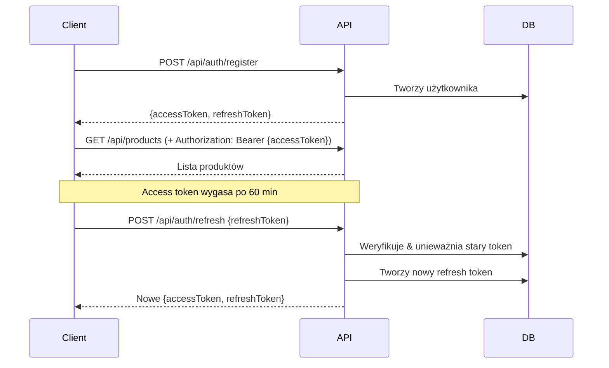

# JWT Authentication w SportRental.Api

## 📋 Przegląd

Aplikacja implementuje kompletną autoryzację JWT dla klientów z następującymi funkcjami:
- ✅ Rejestracja nowych klientów
- ✅ Logowanie z JWT tokens (access + refresh)
- ✅ Refresh token rotation
- ✅ Logout (revoke token)
- ✅ ASP.NET Core Identity integration
- ✅ PostgreSQL storage dla refresh tokens

## 🔐 Endpoints

### POST /api/auth/register
Rejestracja nowego klienta

**Request:**
```json
{
  "email": "jan.kowalski@example.com",
  "password": "SecurePass123!",
  "fullName": "Jan Kowalski"  // opcjonalne
}
```

**Response (200):**
```json
{
  "accessToken": "eyJhbGc...",
  "refreshToken": "base64_token...",
  "expiresIn": 3600,
  "tokenType": "Bearer",
  "user": {
    "id": "guid",
    "email": "jan.kowalski@example.com",
    "tenantId": "guid"
  }
}
```

### POST /api/auth/login
Logowanie istniejącego klienta

**Request:**
```json
{
  "email": "jan.kowalski@example.com",
  "password": "SecurePass123!"
}
```

**Response (200):** - identyczna jak przy rejestracji

### POST /api/auth/refresh
Odświeżenie access token używając refresh token

**Request:**
```json
{
  "refreshToken": "base64_token..."
}
```

**Response (200):** - identyczna jak przy logowaniu

### POST /api/auth/revoke
Unieważnienie refresh token (logout)

**Request:**
```json
{
  "refreshToken": "base64_token..."
}
```

**Response (204 No Content)**

## 🔧 Konfiguracja

### appsettings.json
```json
{
  "Jwt": {
    "SigningKey": "your-super-secret-key-min-32-chars-change-in-production!",
    "Issuer": "SportRentalApi",
    "Audience": "SportRentalClient",
    "AccessTokenLifetimeMinutes": 60,
    "RefreshTokenLifetimeDays": 7
  }
}
```

**⚠️ WAŻNE:** W produkcji użyj User Secrets lub Azure Key Vault dla `SigningKey`!

### Wymagania hasła (Identity)
- Min. 8 znaków
- Wymaga cyfr
- Wymaga małych liter
- Wymaga wielkich liter
- Nie wymaga znaków specjalnych

### Lockout Policy
- 5 nieudanych prób logowania
- Blokada na 15 minut

## 🛡️ Bezpieczeństwo

1. **Access Token:** Krótkoterminowy (60 min), zawiera claims użytkownika
2. **Refresh Token:** Długoterminowy (7 dni), przechowywany w bazie
3. **Token Rotation:** Stary refresh token jest unieważniany przy odnowieniu
4. **Revocation:** Możliwość natychmiastowego unieważnienia tokenów

## 📝 JWT Claims

Access token zawiera:
```
- sub: User ID
- email: Email użytkownika
- tenant-id: ID tenanta
- role: "Client"
- NameIdentifier: User ID
```

## 🧪 Testowanie (Swagger)

1. Otwórz Swagger UI: `https://localhost:7142/swagger`
2. Zarejestruj użytkownika: `/api/auth/register`
3. Skopiuj `accessToken` z odpowiedzi
4. Kliknij "Authorize" w Swagger UI
5. Wklej token (bez "Bearer")
6. Testuj chronione endpoints

## 🔄 Flow użycia



## 🗄️ Migracja bazy danych

Refresh tokens są przechowywane w tabeli `RefreshTokens`:
```sql
CREATE TABLE RefreshTokens (
    Id uniqueidentifier PRIMARY KEY,
    UserId uniqueidentifier NOT NULL,
    Token nvarchar(128) NOT NULL UNIQUE,
    ExpiresAtUtc datetime2 NOT NULL,
    CreatedAtUtc datetime2 NOT NULL,
    IsRevoked bit NOT NULL,
    RevokedReason nvarchar(200) NULL,
    RevokedAtUtc datetime2 NULL,
    ReplacedByToken nvarchar(128) NULL
);
```

Dodaj migrację EF Core:
```bash
# Uruchom z katalogu SportRental.Api
dotnet ef migrations add AddJwtRefreshTokens --context ApplicationDbContext
dotnet ef database update
```

## 🚀 Produkcja - Checklist

- [ ] Zmień `Jwt:SigningKey` (min. 32 znaki losowe)
- [ ] Ustaw `options.SignIn.RequireConfirmedEmail = true`
- [ ] Skonfiguruj HTTPS everywhere
- [ ] Włącz Rate Limiting dla auth endpoints
- [ ] Monitoruj nieudane próby logowania
- [ ] Regularnie czyść wygasłe refresh tokens
- [ ] Rozważ 2FA dla wrażliwych operacji
- [ ] Użyj Azure Key Vault / AWS Secrets Manager

## 📚 Więcej informacji

- [JWT.io](https://jwt.io/) - Dekoder JWT
- [ASP.NET Core Identity](https://learn.microsoft.com/en-us/aspnet/core/security/authentication/identity)
- [JWT Bearer Authentication](https://learn.microsoft.com/en-us/aspnet/core/security/authentication/jwt-bearer)
