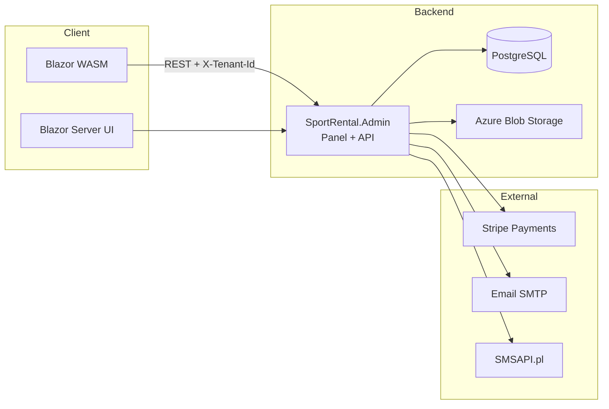
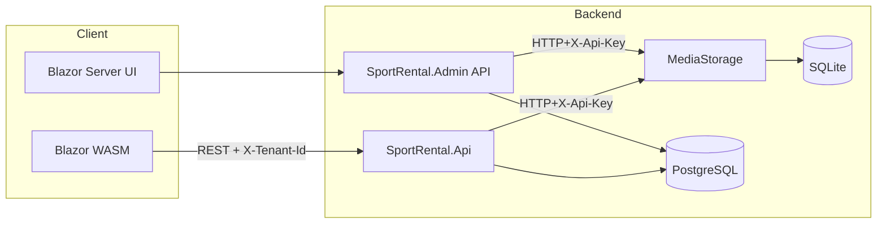

# SportRental Architecture

> See `docs/SHOWCASE.md` for an English showcase, demo script, and talking points.

## ⚠️ Aktualna architektura (grudzień 2025)

**WAŻNE:** Obecna architektura jest uproszczona w stosunku do pierwotnego planu:

- **SportRental.Admin** - Blazor Server hostujący panel administracyjny **ORAZ API dla klienta WASM**
- **SportRental.Client** - Blazor WASM łączący się z API w Admin
- **SportRental.Api** - ⏸️ **WYŁĄCZONY** - przygotowany na przyszłość gdy potrzeba osobnego serwera API
- **SportRental.MediaStorage** - ⏸️ **WYŁĄCZONY** - pliki są przechowywane bezpośrednio w Azure Blob Storage

## Cele architektury
- Separacja domeny biznesowej, interfejsu administracyjnego i kanalu klienckiego.
- Latwe powielanie instancji (multi-tenant) przy zachowaniu izolacji danych.
- Maksymalne ponowne uzycie komponentow (biblioteka `SportRental.Shared`).
- Modularnosc pozwalajaca w przyszlosci wydzielac mikroserwisy.
- Wysoka testowalnosc (xUnit, bUnit, WebApplicationFactory) oraz latwe uruchamianie w srodowisku deweloperskim.

## Projekty w rozwiazaniu
### SportRental.Admin (panel administracyjny)
- Blazor Server hostujacy panel i wewnetrzne API.
- Katalogi: `Api/` (minimal API dla panelu), `Components/` (UI MudBlazor), `Data/` (EF Core, multi-tenancy), `Services/` (email, sms, raporty, pdf, storage), `wwwroot/` (zasoby statyczne).
- Hosted services: `MediaStorageProcessHostedService` (autostart mikroserwisu plikow), przypomnienia e-mail/SMS.
- Konfiguracja w `Program.cs` oplata DI, Swagger panelowy, Rate Limiting, Health Checks.

### SportRental.Api (publiczne REST API) - ⏸️ WYŁĄCZONY
> **Uwaga:** Ten projekt jest obecnie wyłączony. API dla klienta WASM jest hostowane w SportRental.Admin.
> Projekt jest przygotowany na przyszłość gdy będzie potrzeba osobnego serwera API (np. skalowanie, microservices).

- Minimal API wystawiajace zasoby dla klienta zewnętrznego (produkty, holdy, wynajmy, uploady).
- Buduje sie na `ApplicationDbContext` z projektu `SportRental.Infrastructure` (PostgreSQL) i wymaganym naglowku `X-Tenant-Id`.

### SportRental.Client (Blazor WebAssembly)
  - Moduly: Pages/ (landing, katalog, koszyk, konto klienta), Layout/, Components/, Services/, wwwroot/ (Tailwind), Program.cs (rejestracja serwisow).
  - ApiService zapewnia jednolity dost�p do REST API i magazynu plik�w, a CustomerSessionService przechowuje dane klienta w localStorage.
  - Funkcje UI: rejestracja/logowanie po emailu + telefonie, edycja profilu, historia wynajm�w z informacj� o p�atno�ciach/depozytach.

### SportRental.MediaStorage (mikroserwis plikow) - ⏸️ WYŁĄCZONY
> **Uwaga:** Ten projekt jest obecnie wyłączony. Pliki (zdjęcia produktów) są przechowywane bezpośrednio w Azure Blob Storage.
> Projekt jest przygotowany na przyszłość gdy zmiana hostingu (np. self-hosted bez Azure).

- Minimal API na SQLite (`MediaStorageDbContext`), konfiguracja `StorageOptions` i `SecurityOptions`.
- Endpointy: upload (`POST /api/files`), metadane (`GET /api/files/{id}`), usuwanie (`DELETE /api/files/{id}`), serwowanie (`GET/HEAD /files/...`).
- Walidacja rozmiaru, rozszerzen i nadawanie sciezek per tenant.

### SportRental.MediaStorage.Tests
- Testy integracyjne i jednostkowe dla `FileStorageService` i endpointow przy uzyciu `WebApplicationFactory`.

### SportRental.Shared
- Projekt Razor Class Library z DTO, serwisami HTTP (`IApiService`, `CartService`), komponentami UI i pomocniczym JS interop.
- Wspoldzielony pomiedzy panel, klientem WASM oraz testami.

## Warstwy i przeplyw (aktualna architektura)

### Diagram oryginalnej architektury (na przyszłość)

## Glowne scenariusze
1. **Przeglad katalogu**: klient WASM -> `GET /api/products` (naglowek `X-Tenant-Id`) -> PostgreSQL.
2. **Rezerwacja hold**: WASM -> `POST /api/holds` -> wpis do `ReservationHolds` (z TTL). Panel wyswietla holdy.
3. **Tworzenie wynajmu**: WASM -> `POST /api/rentals` -> zapis `Rental` + `RentalItems`. Panel potwierdza, generuje kontrakt, wysyla powiadomienia.
4. **Upload zdjecia produktu**: panel -> `POST /api/products/{id}/image` -> `SportRental.Api` -> `SportRental.MediaStorage` (upload) -> aktualizacja pola `ImageUrl`.
5. **Serwowanie pliku**: klient -> `GET https://media/.../files/...` -> `SportRental.MediaStorage` -> odczyt z dysku SQLite/FS.

## Multi tenancy i bezpieczenstwo
- Tenant identyfikowany GUID-em. Panel korzysta z `ITenantProvider`, API publiczne wymaga naglowka `X-Tenant-Id` (walidacja middleware).
- Dostep uzytkownikow panelu zarzadzany przez ASP.NET Core Identity oraz role.
- Role globalne: `SuperAdmin`, `Owner`, `Employee`, `Client`. Seedowanie odbywa sie w `Program.cs`, a promotowanie wlasciciela (`/setup`) i tworzenie pracownika automatycznie dopisuje role `Client`/`Employee` oraz wpis w `TenantUsers`.
- MediaStorage opcjonalnie wymaga `X-Api-Key` (konfiguracja `SecurityOptions:ApiKeys`).
- Hosted service moze uruchamiac proces magazynu lokalnie (tylko w Development).

## Warstwa danych
- `ApplicationDbContext` (PostgreSQL) obejmuje produkty, wynajmy, holdy, tenants, identity.
- `MediaStorageDbContext` (SQLite) przechowuje metadane plikow.
- Migracje EF Core sa przechowywane w `SportRental.Admin/Migrations` i `SportRental.MediaStorage/Data/Migrations` (automatyczne `EnsureCreated`).

## Komunikacja z MediaStorage
- `SportRental.Api` i `SportRental.Admin` korzystaja z `IHttpClientFactory("MediaStorage")` oraz dedykowanego helpera `UploadFileAsync` (wstrzykiwanie API key, sciezki).
- Sciezki plikow zawieraja identyfikator tenant i wersje (`images/products/{tenant}/{product}/vX`).
- Dla klienta docelowy URL budowany jest z `MediaStorage:BaseUrl` (np. CDN) lub lokalnej sciezki fallback.

## Zadania w tle
- `MediaStorageProcessHostedService` (panel) moze startowac mikroserwis plikow przy starcie aplikacji (DEV only).
- `RentalReminderService` wyszukuje wynajmy wymagajace powiadomien i wysyla e-maile.
- Health checks konfigurowane w panelu do monitoringu bazy, identity i MediaStorage.

## Konfiguracja i srodowiska
- **KRYTYCZNE:** Projekt używa **Azure Key Vault** dla wszystkich sekretów - lokalnie i na produkcji!
- Kluczowe pliki: `SportRental.Admin/appsettings.Development.json`, `SportRental.Api/appsettings.Development.json`.
- **Wymagana konfiguracja:** Tylko `KeyVault:Url` w appsettings per środowisko (dev/staging/prod).
- **Sekrety w Key Vault:** `ConnectionStrings--DefaultConnection`, `Stripe--SecretKey`, `Jwt--SigningKey`, `Email--Smtp--Password`, `Storage--AzureBlob--ConnectionString`.
- **Lokalne uruchomienie:** Wymagane `az login` aby DefaultAzureCredential mógł pobrać sekrety z Key Vault.
- **Produkcja:** Managed Identity z rolą "Key Vault Secrets User" automatycznie pobiera sekrety.
- **Certyfikaty HTTPS:** `dotnet dev-certs https --trust`.
- **Dokumentacja:** Zobacz `doc/setup/AZURE_KEY_VAULT_SETUP.md` dla szczegółów.

## Obserwowalnosc
- Logowanie: domyslnie Console + Debug, strukturalne informacje w serwisach (`ILogger`).
- Health checks i Swagger wlaczone w Development.
- Planowane: Serilog + Application Insights (opisane w `ROADMAP.md`).

## Kierunki rozwoju architektury
- Reaktywacja SportRental.Api jako osobny serwer gdy potrzeba skalowania
- Reaktywacja SportRental.MediaStorage gdy zmiana hostingu z Azure
- Wyodrebnienie kolejnych uslug (np. powiadomienia) przy uzyciu kolejek.
- MAUI front-end wykorzystujacy `SportRental.Shared` (opis w roadmapie).
- Przygotowanie obrazow Docker dla kazdej uslugi.

## Nowe funkcje (grudzień 2025)
- **Wynajem godzinowy** - obsługa `HourlyPrice`, `RentalType`, `HoursRented` w produktach i wynajmach
- **SMS notifications** - integracja z SMSAPI.pl (potwierdzenia, przypomnienia)
- **Reservation holds** - tymczasowe rezerwacje w koszyku z TTL
- **Stripe Checkout Sessions** - pełna integracja płatności z depozytami
- **Visual Studio multi-project launch** - profil "Admin + Client" uruchamia oba projekty

