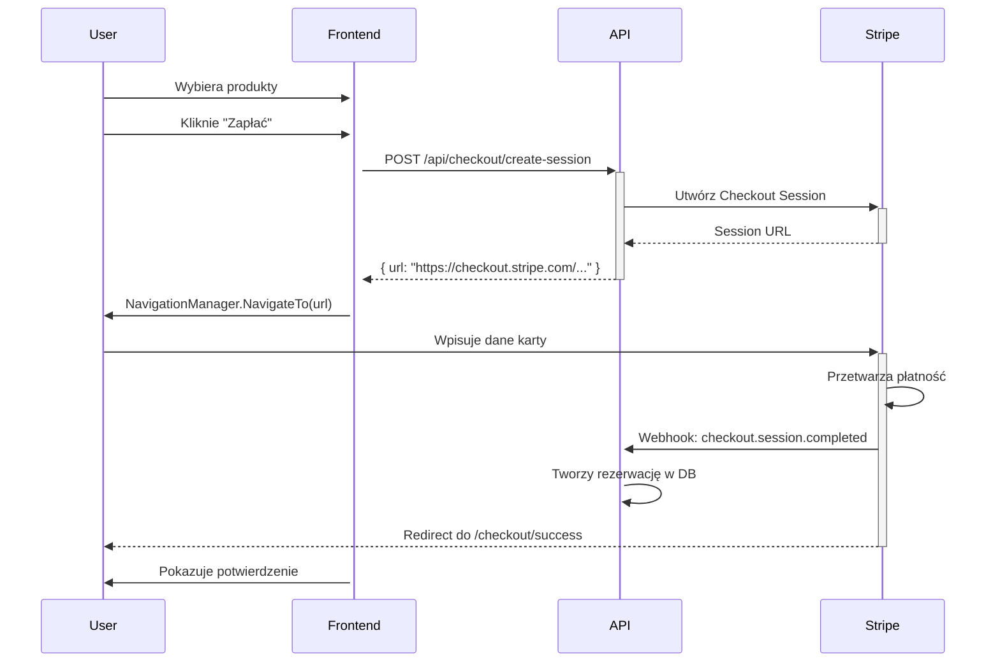

# 🧪 Stripe Sandbox - Przewodnik Testowania Płatności

## 🚀 Quick Start

### 1. Uruchom wszystkie serwisy:

```powershell
# Terminal 1: API
cd SportRental.Api
dotnet run
# → https://localhost:7142

# Terminal 2: Client WASM
cd SportRental.Client
dotnet run
# → http://localhost:5014

# Terminal 3: Stripe Webhooks
.\start-stripe-webhooks.ps1
# → Przekierowanie webhooków z Stripe
```

### 2. Przetestuj płatność:

1. Otwórz: http://localhost:5014
2. Wybierz produkty do wypożyczenia
3. Dodaj do koszyka
4. Kliknij "Przejdź do płatności"
5. Zostaniesz przekierowany do Stripe Checkout
6. Użyj test card: **4242 4242 4242 4242**
7. CVV: **123**, Data: **12/34**
8. Kliknij "Pay"
9. Zostaniesz przekierowany z powrotem: `/checkout/success`

## 💳 Test Cards (Sandbox)

### ✅ Sukces:
```
Numer karty:  4242 4242 4242 4242
CVV:          dowolne 3 cyfry
Data:         dowolna przyszła (np. 12/34)
```

### ❌ Odmowa płatności:
```
4000 0000 0000 0002  → Card declined
4000 0000 0000 9995  → Insufficient funds
4000 0000 0000 9987  → Lost card
4000 0000 0000 9979  → Stolen card
```

### 🔐 3D Secure (wymaga dodatkowej autoryzacji):
```
4000 0025 0000 3155  → 3DS required
4000 0027 6000 3184  → 3DS2 required
```

### 🇵🇱 BLIK Test Code:
```
777777  → Sukces
```

### 💶 Różne waluty:
```
4000 0005 6200 0001  → PLN (Polska)
4000 0007 6000 0002  → EUR (Europa)
4000 0008 2600 0000  → GBP (UK)
```

## 🌐 Stripe Checkout Session Flow

### Nasz Flow (BEZ JavaScript!):



## 🔧 Konfiguracja Stripe CLI

### Instalacja (jeśli nie masz `stripe.exe`):

**Windows:**
```powershell
# Pobierz z GitHub Releases
# https://github.com/stripe/stripe-cli/releases/latest
# Rozpakuj stripe.exe do katalogu projektu
```

**lub przez Chocolatey:**
```powershell
choco install stripe-cli
```

### Logowanie:

```powershell
.\stripe.exe login
# Wklej klucz API z Dashboard → Developers → API keys
```

### Webhook Forwarding:

```powershell
.\stripe.exe listen --forward-to https://localhost:7142/api/webhooks/stripe
```

**WAŻNE:** Skopiuj `webhook signing secret` (whsec_...) i dodaj do `appsettings.Development.json`:

```json
{
  "Stripe": {
    "WebhookSecret": "whsec_SKOPIUJ_TUTAJ"
  }
}
```

## 🧪 Testowanie przez CLI

### Symuluj webhook (bez UI):

```powershell
# Sukces płatności
.\stripe.exe trigger payment_intent.succeeded

# Nieudana płatność
.\stripe.exe trigger payment_intent.payment_failed

# Checkout Session completed
.\stripe.exe trigger checkout.session.completed
```

### Sprawdź Payment Intents:

```powershell
# Lista ostatnich
.\stripe.exe payment_intents list --limit 10

# Szczegóły konkretnego
.\stripe.exe payment_intents retrieve pi_3ABC...
```

### Sprawdź Checkout Sessions:

```powershell
# Lista ostatnich
.\stripe.exe checkout sessions list --limit 10

# Szczegóły konkretnego
.\stripe.exe checkout sessions retrieve cs_test_...
```

### Sprawdź eventy webhooków:

```powershell
# Lista ostatnich eventów
.\stripe.exe events list

# Szczegóły eventu
.\stripe.exe events retrieve evt_...
```

## 📊 Monitorowanie w Stripe Dashboard

1. Otwórz: https://dashboard.stripe.com/test/dashboard
2. Przejdź do **Payments** → Zobacz wszystkie transakcje
3. Przejdź do **Developers** → **Webhooks** → Zobacz eventy
4. Przejdź do **Developers** → **Events** → Zobacz logi

## 🐛 Troubleshooting

### Problem: Webhook nie działa

**Rozwiązanie:**
```powershell
# 1. Sprawdź czy API działa
curl https://localhost:7142/api/webhooks/stripe

# 2. Sprawdź czy Stripe CLI jest podłączony
.\stripe.exe listen --forward-to https://localhost:7142/api/webhooks/stripe

# 3. Sprawdź logi API - powinny pokazać webhook requests
```

### Problem: Payment Intent "requires_payment_method"

**To normalne!** Stripe wymaga interakcji użytkownika (wpisania karty). 

**Opcje:**
1. Użyj Stripe Checkout (nasze rozwiązanie) - user wpisuje kartę na Stripe
2. Użyj Payment Intents API + Stripe.js - musisz dodać formularz karty
3. Dla testów CLI: `.\stripe.exe trigger payment_intent.succeeded`

### Problem: CORS errors

API już ma CORS skonfigurowany dla `http://localhost:5014`. Jeśli używasz innego portu:

```csharp
// SportRental.Api/Program.cs
builder.Services.AddCors(options =>
{
    options.AddDefaultPolicy(policy =>
    {
        policy.WithOrigins("http://localhost:5014", "http://localhost:TWOJ_PORT")
              .AllowAnyHeader()
              .AllowAnyMethod();
    });
});
```

## 💡 Pro Tips

### 1. Test różnych scenariuszy:
```powershell
# Udana płatność → Checkout
.\stripe.exe trigger checkout.session.completed

# Nieudana płatność → Email do klienta?
.\stripe.exe trigger payment_intent.payment_failed

# Zwrot → Refund processing
.\stripe.exe trigger charge.refunded
```

### 2. Sprawdź metadata w Dashboard:
- Każdy Payment Intent ma `tenant_id`, `rental_start`, `rental_end`
- Użyj tego do debugowania: który tenant, która rezerwacja

### 3. Test webhook retry:
Stripe automatycznie retry webhooks przez 3 dni jeśli endpoint zwraca error (5xx)

### 4. Webhook signing verification:
W DEV możesz wyłączyć verification (API sprawdza czy `WebhookSecret` jest pusty)

## 📚 Dokumentacja Stripe

- **Checkout:** https://stripe.com/docs/payments/checkout
- **Payment Intents:** https://stripe.com/docs/payments/payment-intents
- **Webhooks:** https://stripe.com/docs/webhooks
- **Test Cards:** https://stripe.com/docs/testing
- **CLI:** https://stripe.com/docs/stripe-cli

## 🎯 Twoja Konfiguracja (z projektu cyklicznego)

Masz już:
```json
{
  "SecretKey": "sk_test_51SEAHm1gNFkk1Nsc...",
  "PublishableKey": "pk_test_51SEAHm1gNFkk1Nsc...",
  "WebhookSecret": "whsec_c646e1a975435715ecc512f...",
  "PriceIds": {
    "Monthly": "price_1SESh61gNFkk1NscsKzWObYI",
    "Yearly": "price_1SEShD1gNFkk1Nsc5gB3GTAQ"
  },
  "ProductId": "prod_TAoJaYxDkhs0ve"
}
```

**Uwaga:** Price IDs i Product ID są dla płatności cyklicznych (subscriptions).
W tym projekcie używamy **Payment Intents** (one-time payments) - nie potrzebujemy Price IDs.

## ✅ Gotowe do testowania!

```powershell
# 1. Uruchom pomocnik
.\test-stripe-payment.ps1

# 2. Start wszystkich serwisów
.\start-stripe-webhooks.ps1

# 3. Testuj na http://localhost:5014
```

**Happy testing! 💳✨**
