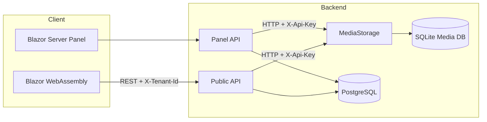
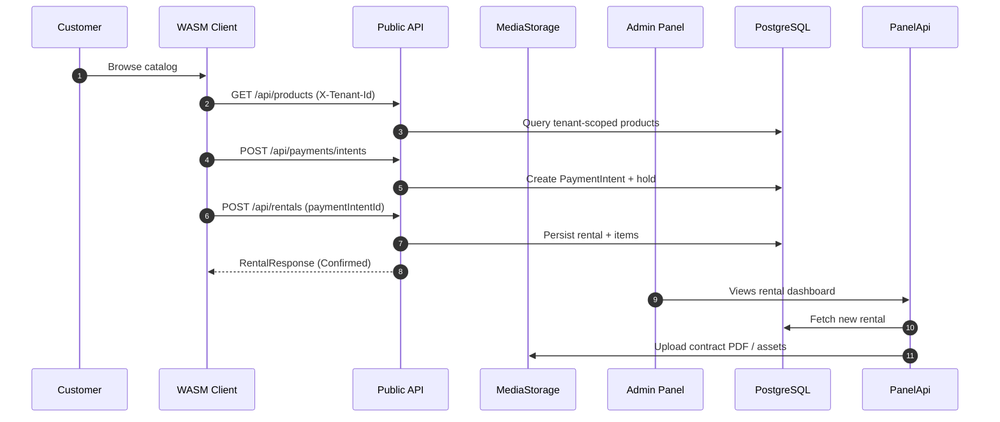

# SportRental Showcase

## Elevator pitch
SportRental is a production-style, multi-tenant rental platform that demonstrates how to blend Blazor Server, Blazor WebAssembly, minimal APIs, and a dedicated media microservice into one cohesive solution. It features tenant-aware catalog management, reservation holds, mocked payment intents with deposits, and a polished administrator workflow backed by nearly 300 automated tests. The codebase is built on .NET 9 RC and showcases modern MudBlazor UI patterns, clean architecture, and developer ergonomics that scale.

## Value proposition
- **Real product surface area**: admin operations, customer-facing storefront, REST API, and media delivery are all implemented.
- **Multi-tenant by design**: tenant identifiers flow through the database, APIs, storage paths, and Identity provisioning.
- **Modular architecture**: separate projects for panel, public API, WebAssembly frontend, media microservice, shared library, and dedicated test suites.
- **Ready for real clients**: mocked payment intent flow, contract PDF generation, QR codes, email/SMS notifications, and task scheduling.
- **Testing first**: xUnit, bUnit, and WebApplicationFactory ensure the stack is regression-safe out of the box.

## Architecture story

### Rental checkout flow (simplified)

## Feature matrix
| Area | Key capabilities | Highlights |
| --- | --- | --- |
| Admin panel | Product, rental, customer, employee modules; dashboards; reminders | MudBlazor UI, role seeding, QR/PDF generation, background hosted services |
| Public API | Catalog, holds, rentals, payment quotes, payment intents, media upload proxy | Tenant header enforcement, ProblemDetails errors, Swagger with API key support |
| WASM client | Landing page, catalog, cart, checkout, customer account & history | Tailwind pipeline, localStorage-backed session, shared DTOs |
| Media microservice | Multipart upload, metadata storage, secure delivery | API key auth, per-tenant paths, SQLite metadata, streaming downloads |
| Shared library | DTOs, HTTP clients, Razor components, Identity constants | Reused by panel, WASM, and tests; ready for future MAUI app |
| Testing | xUnit, bUnit, WebApplicationFactory suites | 290+ passing scenarios across API, UI, and media services |

## Implementation highlights
- **Identity onboarding**: `/setup` promotes the first admin to tenant owner, while employee provisioning API assigns both `Employee` and `Client` roles with a temporary password.
- **Hosted services**: media microservice can auto-start during development and reminder jobs send SMS/email notifications for upcoming rentals.
- **Media pipeline**: uploads are validated for size and extension, stored per tenant, and exposed through signed-friendly URLs for the UI.
- **Payment mocks**: `PaymentIntent` emulation unlocks end-to-end checkout without an external gateway; roadmap includes Stripe/PayU integration.
- **Dev experience**: `.editorconfig`, warnings-as-errors, Tailwind watch scripts, dotnet watch, and detailed developer guide keep iteration fast.

## Quality & observability
- 290+ automated tests across solution projects (`dotnet test SportRentalHybrid.sln`).
- Coverage-ready command baked into docs: `dotnet test BlazorApp3.Tests/BlazorApp3.Tests.csproj --collect:"XPlat Code Coverage"`.
- Health checks, structured logging, and Swagger enabled in Development profiles.
- Roadmap includes Serilog + Application Insights, response caching, and rate limiting.

## Demo script (15 minutes)
1. **Warm-up (2 min)**
   - Restore solution, ensure PostgreSQL is up, and run `dotnet ef database update --project BlazorApp3`.
   - Start media storage, public API, admin panel, and WASM client (see README quick start).
2. **Admin onboarding (2 min)**
   - Log into Blazor Server panel using seeded admin credentials.
   - Visit `/setup` to demonstrate tenant promotion and role seeding.
3. **Catalog management (3 min)**
   - Create or edit a product, showcase MudBlazor forms, upload an image (triggers media microservice).
   - Highlight live validation, categories, availability counts, and tenant isolation.
4. **Customer journey (5 min)**
   - Switch to WASM client, browse catalog (data served via REST API with tenant header).
   - Add items to cart, request payment quote, and confirm mocked payment intent.
   - Complete checkout to create a rental; show confirmation and history view populated via API.
5. **Operations follow-up (3 min)**
   - Return to admin panel dashboard, refresh rentals view, demonstrate PDF/QR generation and reminder scheduling.
   - Review logs/health checks if time permits.
6. **Wrap-up (optional)**
   - Discuss roadmap items (JWT auth, real payments, Docker/CI) and open-source readiness checklist.

## Talking points for portfolios & interviews
- Emphasize end-to-end ownership: architecture, APIs, UI, testing, and automation.
- Highlight multi-tenant data design and how tenant id flows through every layer.
- Showcase MudBlazor custom components and Tailwind integration for modern UI.
- Call out testing depth (unit, integration, component) and plans for coverage metrics.
- Mention roadmap commitments: JWT auth, payment gateway, Docker, CI/CD, MAUI client.

## Next steps before open-sourcing
- Add a license (MIT or Apache-2.0 recommended for broad adoption).
- Publish GitHub Actions workflow for restore/build/test plus Tailwind build.
- Capture screenshots or short Loom clips of the admin panel and client flows.
- Provide sanitized seed data for demo tenants or scripted seed commands.
- Expand observability story (Serilog, Application Insights) as described in `ROADMAP.md`.

## References
- [README.md](../README.md)
- [ARCHITECTURE.md](../ARCHITECTURE.md)
- [DEVELOPER_GUIDE.md](../DEVELOPER_GUIDE.md)
- [API_DOCUMENTATION.md](../API_DOCUMENTATION.md)
- [ROADMAP.md](../ROADMAP.md)

Use this document as a ready-made narrative when presenting SportRental on GitHub, LinkedIn, or during interviews.
