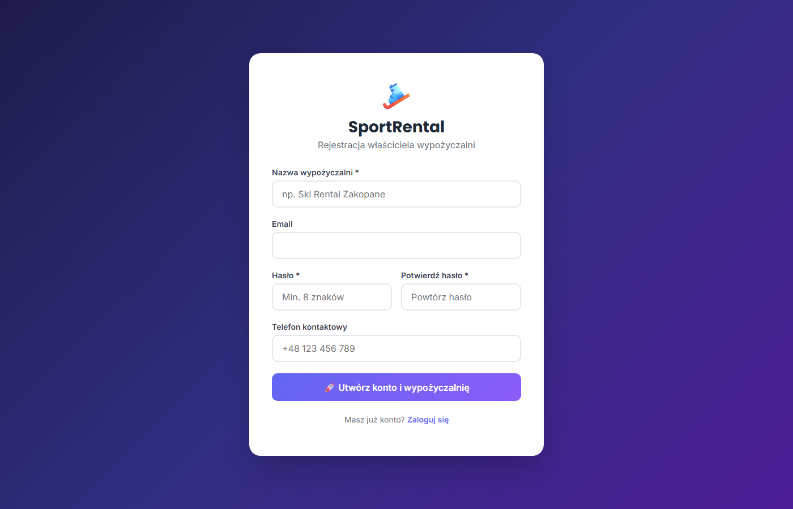
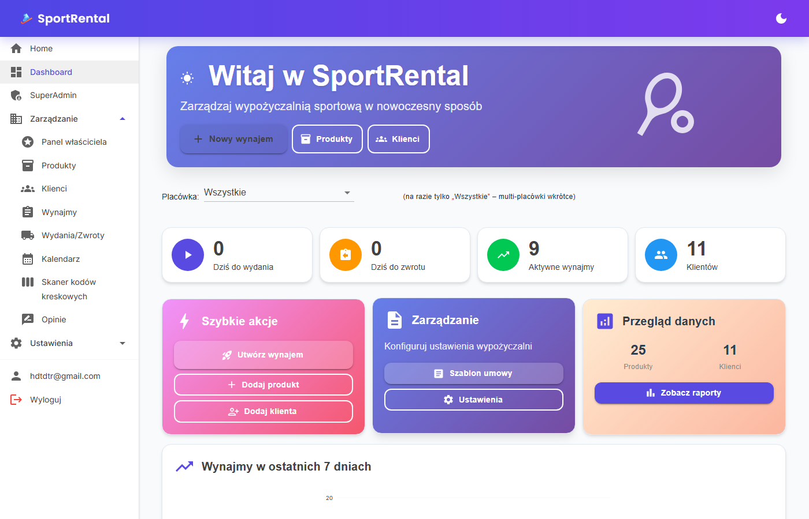
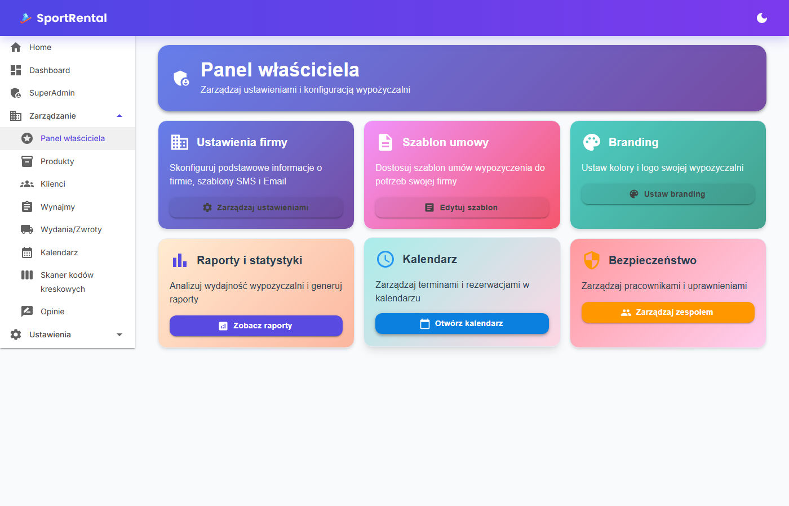
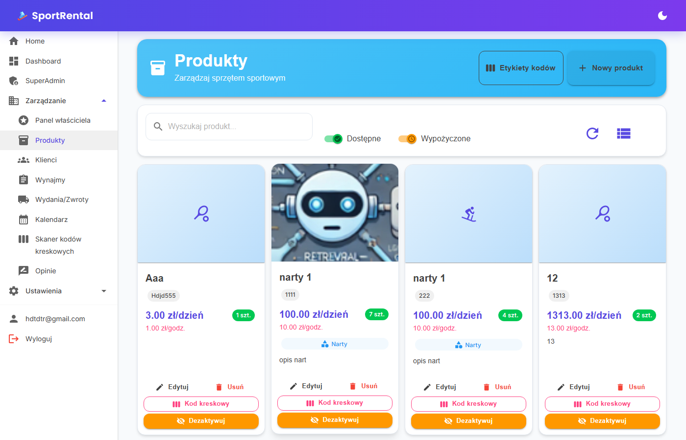
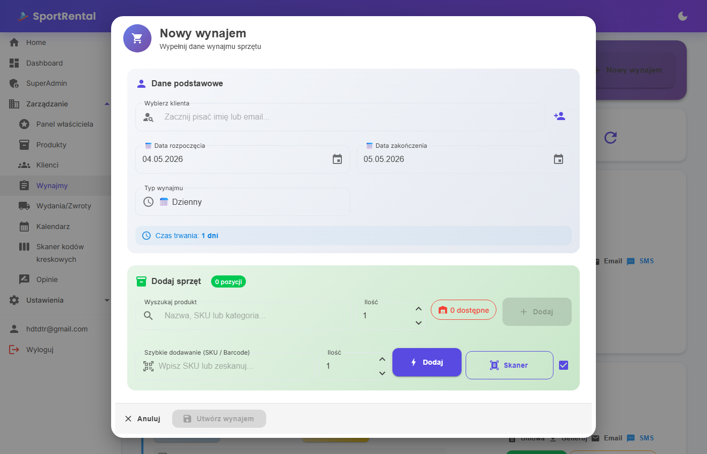
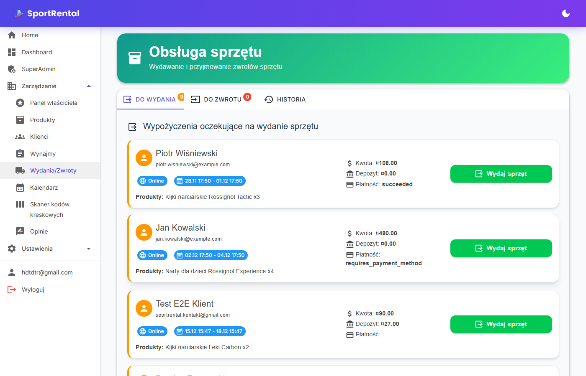
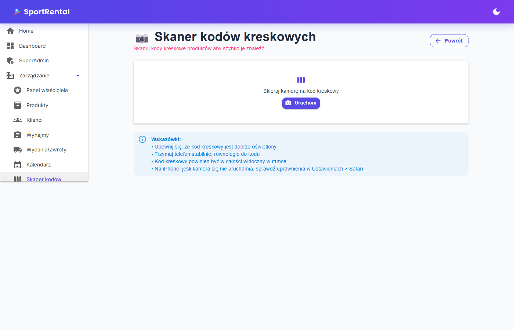
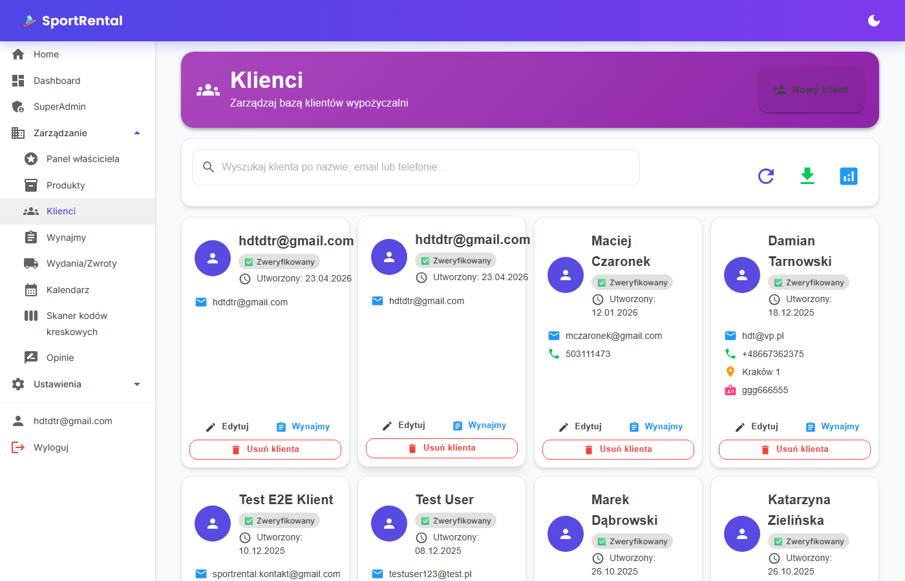
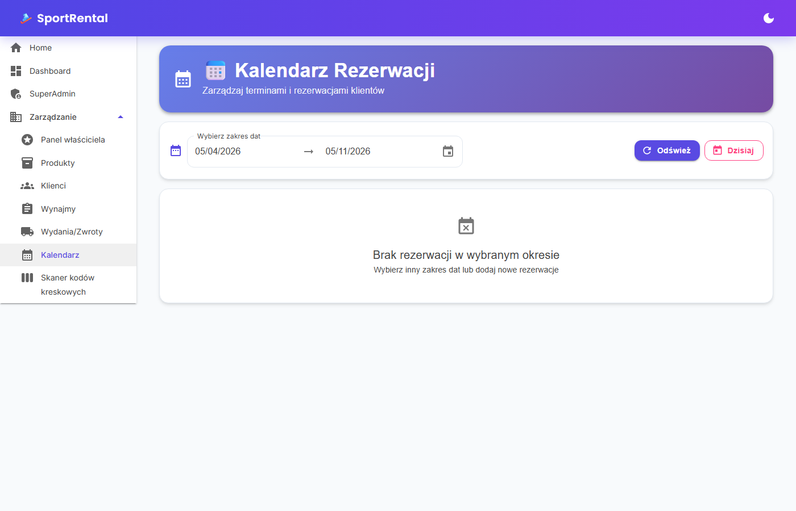
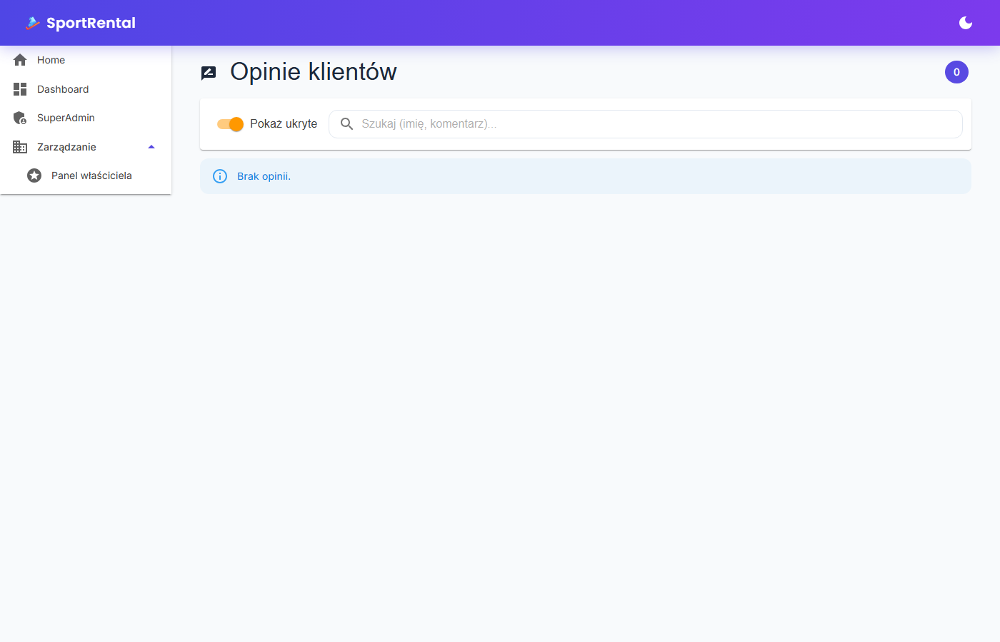

# SportRental — instrukcja dla wypożyczalni

**Link do panelu:** [srental2.azurewebsites.net](https://srental2.azurewebsites.net)

SportRental to system zarządzania wypożyczalnią sprzętu sportowego — od rezerwacji online,
przez wydanie i zwrot, po automatyczne kontrakty PDF i przypomnienia email/SMS. Działa
w przeglądarce na komputerze, telefonie i tablecie. Nic nie instalujesz.

---

## 1. Założenie konta

1. Wejdź na **[srental2.azurewebsites.net/Account/RegisterOwner](https://srental2.azurewebsites.net/Account/RegisterOwner)**
2. Wypełnij formularz:
   - **Nazwa wypożyczalni** (np. „Ski Rental Zakopane")
   - **Email** (na ten adres będą szły powiadomienia administracyjne)
   - **Hasło** — minimum 8 znaków
   - **Telefon kontaktowy** (opcjonalny, ale przydatny dla klientów)
3. Klikasz **„Utwórz konto i wypożyczalnię"** — od razu jesteś zalogowany.

> Konto, które zakładasz, ma najwyższe uprawnienia (Owner). Pracowników dodasz
> później przez zaproszenie mailowe (Ustawienia → Pracownicy).

---

## 2. Pierwsze 10 minut po zalogowaniu

### Dashboard

Po zalogowaniu trafiasz na pulpit z podsumowaniem dnia — ile sprzętu jest
do wydania, ile do zwrotu, aktywne wynajmy, klienci. Z lewego menu masz dostęp
do wszystkich funkcji.

### Panel właściciela — dane firmy

**Zarządzanie → Panel właściciela** (`/admin/owner`) — uzupełnij dane firmy.
Te informacje (nazwa, NIP, adres, logo) trafią automatycznie na każdy
wygenerowany kontrakt PDF, fakturę i powiadomienie do klienta.

### Dodaj sprzęt do katalogu

**Zarządzanie → Produkty** (`/admin/products`) → przycisk **„Dodaj produkt"**.
Dla każdego sprzętu podajesz: nazwę, SKU/kod, kategorię, cenę dzienną i godzinową,
liczbę sztuk, opcjonalnie zdjęcie i lokalizację. Możesz też wgrać zdjęcia w masie.

> SKU jest jednocześnie identyfikatorem dla skanera kodów kreskowych — wpisz tu
> taki, który będziesz drukował na metkach (np. `ROW-001` dla pierwszego roweru).

---

## 3. Cykl wynajmu — od rezerwacji do zwrotu

### Krok 1 — Tworzenie wynajmu

**Zarządzanie → Wynajmy** (`/admin/rentals`) → przycisk **„Nowy wynajem"**.

W okienku:

- **Wybierz klienta** — zacznij wpisywać imię/email; jeśli nie ma w bazie, kliknij ikonę
  „dodaj klienta" obok pola
- **Daty** — wybierz początek i koniec; przełącznik **Dzienny / Godzinowy** zmienia
  sposób naliczania ceny
- **Sprzęt** — wpisz nazwę produktu w wyszukiwarce LUB użyj „Szybkie dodawanie"
  z polem SKU/Barcode (idealnie pod skaner USB)
- Możesz wybrać **„Skaner"** żeby otworzyć kamerę telefonu

Klikasz **„Utwórz wynajem"**. System tworzy rekord, generuje kontrakt PDF, wysyła
klientowi email z potwierdzeniem.

### Krok 2 — Wydanie sprzętu (przy odbiorze)

**Zarządzanie → Wydania/Zwroty** (`/admin/equipment-handling`) → zakładka
**„Wydanie"**.

Lista pokazuje wynajmy oczekujące na wydanie. Klikasz konkretny wynajem,
skanujesz po kolei sprzęt (kamerą telefonu lub czytnikiem USB). System
weryfikuje, że SKU pasuje do tej rezerwacji — jeśli zeskanujesz nie ten
sprzęt, dostaniesz alert.

Klient widzi i podpisuje kontrakt (papierowo lub link do podpisu mailem).

### Krok 3 — Zwrot sprzętu

Zakładka **„Zwrot"** — analogicznie. Skanujesz każdą sztukę, oceniasz stan
(OK / uszkodzony / zagubiony). Po zatwierdzeniu zwrotu:

- Sprzęt wraca do dostępnej puli
- Klient dostaje SMS z prośbą o ocenę (60 dni ważności)
- Twoja ocena klienta (terminowość, stan zwrotu, komunikacja) wlicza się do
  jego globalnego scoringu

### Skaner kodów kreskowych

**Zarządzanie → Skaner kodów kreskowych** (`/admin/barcode-scanner`) —
osobny widok dedykowany pod telefon przy ladzie. Otwiera kamerę, skanuje
i od razu pokazuje co to za sprzęt + status.

> Drukuj naklejki z kodami Code 128 (np. z generatora ZebraDesigner lub
> Brother P-touch). System nie używa kodów QR z powodów bezpieczeństwa —
> Code 128 jest trudniejszy do podmienienia.

---

## 4. Co system robi automatycznie

| Akcja | Co dzieje się bez Twojego udziału |
|---|---|
| Tworzysz wynajem | Email z potwierdzeniem do klienta + kontrakt PDF |
| Po SMS od klienta | Zatwierdzona rezerwacja, klient ma pewność że odbierze |
| 24 godziny przed końcem | Przypomnienie email + SMS do klienta |
| Po zwrocie | Prośba o opinię (anonim, link z tokenem ważny 60 dni) |
| Po wystawieniu opinii | Aktualizacja scoringu klienta (cross-tenant) |

### System zaufania klienta

Każdy klient ma poziom (Zweryfikowany / Bez szkód / Wymaga uwagi / Ograniczone)
liczony z ocen ze **wszystkich** wypożyczalni w sieci SportRental. Widzisz status
przy klientcie zanim zaakceptujesz rezerwację. Zerowy próg ingerencji — to czyste
liczby, nie subiektywne komentarze.

### Kalendarz

**Zarządzanie → Kalendarz** (`/admin/schedule`) — widok rezerwacji w czasie.
Przydatne do planowania i unikania konfliktów na sezon szczyt.

### Opinie

**Zarządzanie → Opinie** (`/admin/reviews`) — wszystko, co klienci napisali
o Tobie i Twoim sprzęcie. Możesz odpowiadać i moderować.

---

## 5. Najczęstsze pytania

**Czy klient potrzebuje konta żeby zarezerwować przez stronę?**
Nie. Może przejść jako gość, podając tylko imię + email/telefon przy
checkoucie. Konto jest opcjonalne (i daje historię wynajmów).

**Co jeśli klient zwróci uszkodzony sprzęt?**
Przy zwrocie zaznaczasz „uszkodzony" i opcjonalnie wskazujesz koszt naprawy.
System wystawia korektę — klient dostaje email z informacją o doliczonej
opłacie. Twoja ocena klienta odzwierciedla incydent (wpływa na jego scoring).

**Jak dodać pracownika?**
Ustawienia → Pracownicy → „Zaproś pracownika" — wpisujesz email + rolę
(Pracownik / Kierownik / Manager). Otrzymuje link na 7 dni do założenia hasła.

**Czy działa offline?**
Nie — wymaga połączenia z internetem. Ale przy dobrym 4G/5G na telefonie
działa płynnie nawet w plenerze.

**Czy mogę eksportować dane?**
Tak, **Zarządzanie → Raporty** (`/admin/reports`) — eksport CSV wynajmów,
klientów, przychodów dla księgowej.

---

## 6. Pomoc i kontakt

- **Maciej Czaronek** — kontakt z którym ustaliłeś tę instalację
- W razie pytań technicznych prześlij screenshot błędu + krótki opis co robiłeś

---

*SportRental v1 · 2026-05 · panel: srental2.azurewebsites.net*
